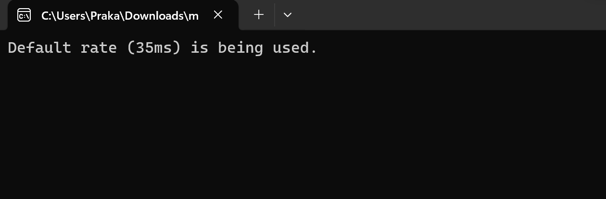
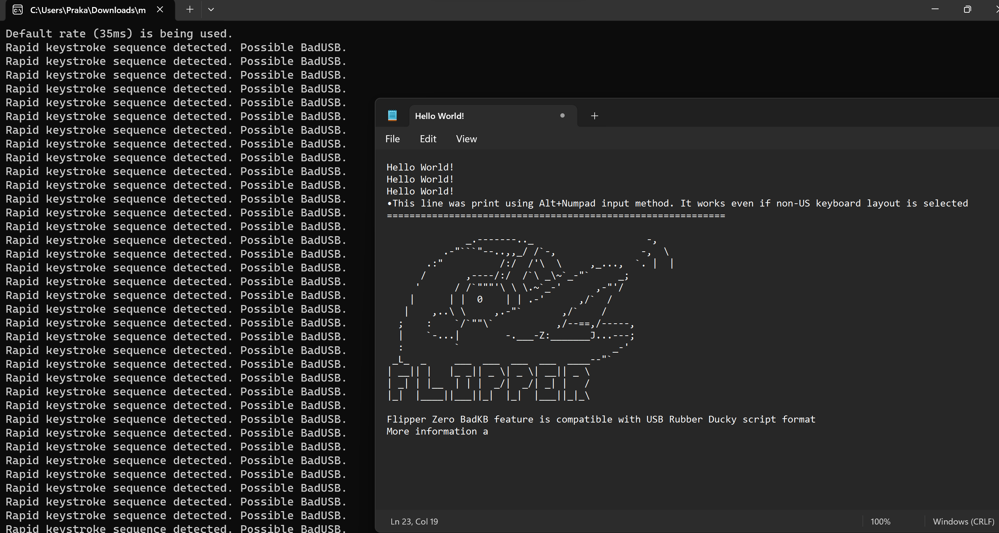
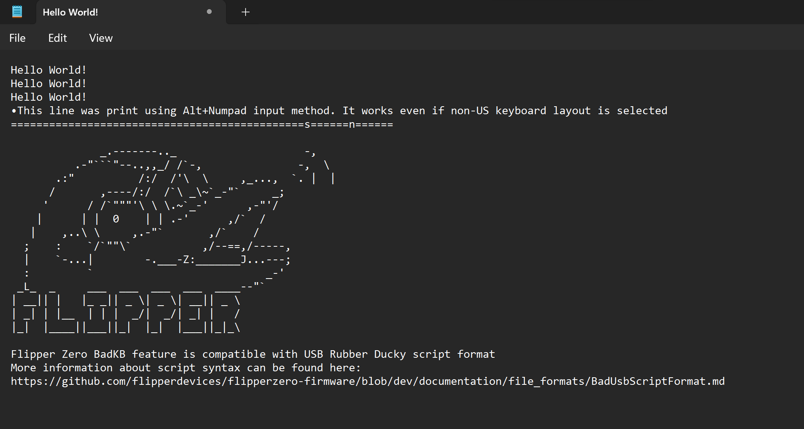

# flipper-zero-project

A new method which I tried and does detect Flipper Zero’s BAD USB capability is tracking the speed at which keystrokes are being entered. The slower speed at which a BAD USB types, the more it is noticeable to the user, hence attackers usually increase the speed at which BAD USB C types codes. This make it different than human typing speed. From some references online I found that for a small Hello World program from the Flipper Zero, it takes 32 milliseconds to types the entire code and as few as 32 keystrokes. For an attacker to execute a malware on the device, they would need as low as 2 milliseconds of speed to type over 300 keystrokes, to make the user not notice the payload being executed. This can be detected by a small piece of code and effectively be used to detect BAD USBs
## Code for detecting BAD USB via Flipper Zero

```c
#include <windows.h>
#include <stdio.h>
#include <time.h>

HHOOK hKeyboardHook;
KBDLLHOOKSTRUCT hooked_key;

#define KEYBUFF_SIZE 10
KBDLLHOOKSTRUCT keyBuffer[KEYBUFF_SIZE];
int keyBufferIndex = 0;
int rate;

// Reporter function for logging
void reporter() {
    printf("Rapid keystroke sequence detected. Possible BadUSB.\n");
    // Optionally, add file logging or other reporting mechanisms here
}

// Function to handle the keyboard input
void bufHandle() {
    DWORD currentTime = GetTickCount();

    // Remove old keystrokes
    while ((keyBufferIndex > 0) && (keyBuffer[0].time < (currentTime - 1000))) {
        // Shift everything left
        for (int i = 0; i < keyBufferIndex - 1; i++) {
            keyBuffer[i] = keyBuffer[i + 1];
        }
        keyBufferIndex--;
    }

    // Add new keystroke
    if (keyBufferIndex < KEYBUFF_SIZE) {
        keyBuffer[keyBufferIndex++] = hooked_key;
    }

    // Check the rate
    if (keyBufferIndex == KEYBUFF_SIZE) {
        float keyRate = (float)(keyBuffer[KEYBUFF_SIZE - 1].time - keyBuffer[0].time) / KEYBUFF_SIZE;
        if (keyRate < rate) {
            reporter();
        }
    }
}

// Hook procedure
LRESULT CALLBACK Keylog(int nCode, WPARAM wParam, LPARAM lParam) {
    if ((nCode == HC_ACTION) && ((wParam == WM_SYSKEYDOWN) || (wParam == WM_KEYDOWN))) {
        hooked_key = *((KBDLLHOOKSTRUCT*)lParam);
        bufHandle();
    }
    return CallNextHookEx(hKeyboardHook, nCode, wParam, lParam);
}

// Setting the hook
DWORD WINAPI Hooker(LPVOID lpParm) {
    HINSTANCE hInstance = GetModuleHandle(NULL);
    hKeyboardHook = SetWindowsHookEx(WH_KEYBOARD_LL, Keylog, hInstance, 0);

    MSG message;
    while (GetMessage(&message, NULL, 0, 0)) {
        TranslateMessage(&message);
        DispatchMessage(&message);
    }
    UnhookWindowsHookEx(hKeyboardHook);
    return 0;
}

int main(int argc, char *argv[]) {
    if (argc == 2) {
        rate = atoi(argv[1]);
    } else {
        printf("Default rate (35ms) is being used.\n");
        rate = 35;
    }

    HANDLE hThread;
    hThread = CreateThread(NULL, 0, Hooker, NULL, 0, NULL);
    if (hThread) {
        WaitForSingleObject(hThread, INFINITE);
        CloseHandle(hThread);
    }
    return 0;
}
```

## Output/ Images:




